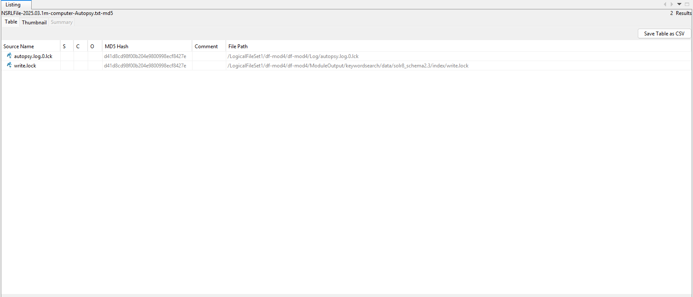
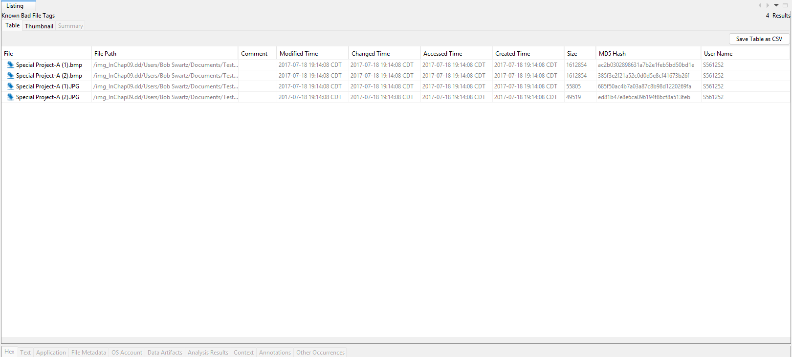
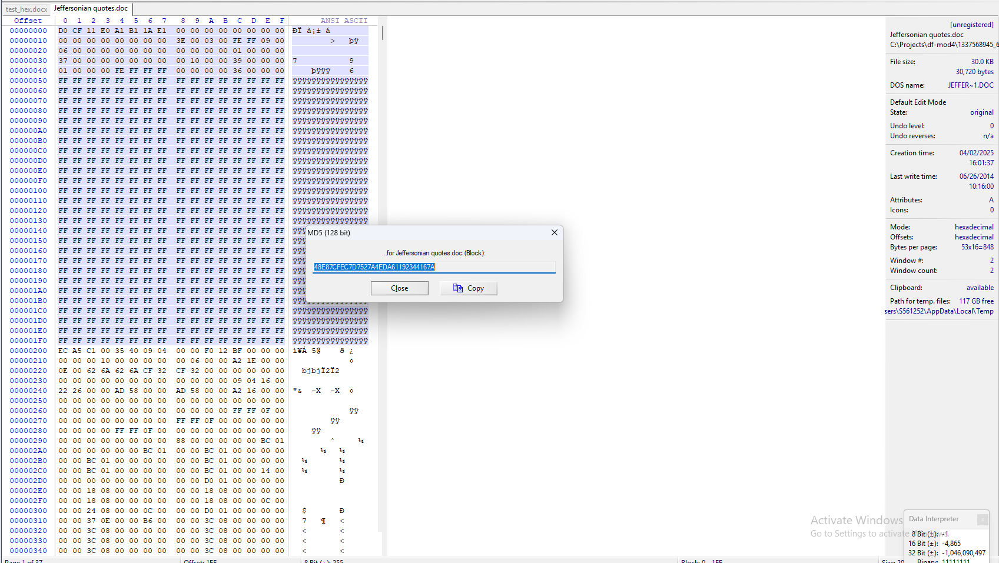
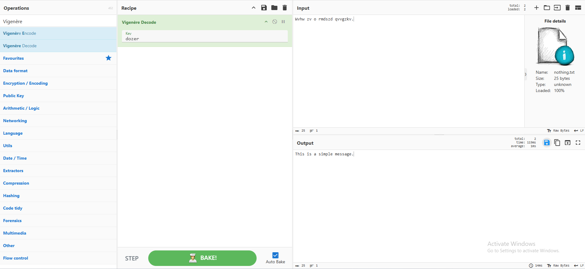

# df_mod4_P4
## Objectives
- This readMe details the outcome of the four tasks described for the Module 4 project.
- Autopsy was used to import a hash database, as well as create one with obsolete images.
- WinHex was used to calculate hashes in order to identify changes in file parameters.
- CyberChef was used to perform simple encryptions and bit shifting.

## Task #1 - Import Hash Database

- Importing a hash database assists invesitgators in filtering out irrelevant files, as well as quickly identifying malware or viruses. It also serves as a quick method for identifying and matching hashes. Importing and exporting a hash database alos gives investigators access to these hashes across multiple devices.

## Task #2 - create Hash Database

- Creating a hash database quickly filter out useful information, or in this case, not so useful information. With a hash database, we now know what hashes are irrelevant in this investigation.

## Task #3

- Hex editors are useful to identify name changes in a file by a criminal, which were done in an effort to fool investigators at the surface level. Since file contents will yield the same hash, a hex editor will offer a quick comparison of two files in question.

## Task #4

- Bit shifting is an operation that requires moving a bit to the left or right, which will consequently change the hash significantly. Criminals can hide evidence by shifting a bit, creating unrecognizeable data. Understanding bit shifting can help restore data and unreadable files.